<div align="center">

# 📊 Bitcoin Market Sentiment × Trader Performance Analysis

### *Hyperliquid Perpetual Futures — Powered by Fear & Greed Index*

[](https://python.org)
[](https://pandas.pydata.org)
[](https://scikit-learn.org)
[](https://xgboost.readthedocs.io)
[](https://jupyter.org)
[](LICENSE)

> **An end-to-end data science project** analyzing how Bitcoin market sentiment (Fear & Greed Index) drives trader profitability, behavior, and risk on Hyperliquid — covering **211,218 trades** from 32 unique traders across **2 years (May 2023 – May 2025)**.

[📁 Project Structure](#-project-structure) · [🚀 Quick Start](#-quick-start) · [📈 Results](#-key-results--findings) · [🖼️ Charts](#%EF%B8%8F-visual-outputs) · [🤖 ML Models](#-machine-learning) · [🔮 Future Work](#-future-enhancements)

</div>

---

## 🧠 Project Overview

This project investigates a core question in quantitative trading:

> **Does the Bitcoin market's emotional state (fear vs greed) meaningfully affect how well traders perform?**

Using the **Alternative.me Fear & Greed Index** merged with **Hyperliquid perpetual futures execution data**, we run a complete data science pipeline covering:

- 🧹 **Data Engineering** — merging two independent datasets on daily date keys
- 🔬 **Exploratory Data Analysis** — 10 dark-theme publication-quality charts
- 📐 **Statistical Testing** — T-Test, ANOVA, Chi-Square, Pearson Correlation
- 👥 **Trader Segmentation** — identifying High / Medium / Low performers
- 🤖 **Machine Learning** — predicting win/loss with 3 models (LR, RF, XGBoost)
- 💡 **Actionable Insights** — strategy recommendations grounded in the data

---

## 📁 Project Structure

```
Primetradeai-Assignment/
│
├── 📂 data/
│   ├── fear_greed.csv              # Bitcoin Fear & Greed Index (2018–2025)
│   └── historical_data.csv         # Hyperliquid trade executions (211K rows)
│
├── 📂 notebooks/
│   └── analysis.ipynb              # Full interactive walkthrough (Jupyter)
│
├── 📂 src/
│   ├── __init__.py
│   ├── preprocessing.py            # Load → clean → merge → feature engineering
│   ├── eda.py                      # 10 charts + 4 statistical tests + segmentation
│   ├── modeling.py                 # ML pipeline (LR, RF, XGBoost)
│   └── utils.py                    # Dark-theme style helpers
│
├── 📂 outputs/
│   ├── 📂 figures/                 # 13 auto-generated PNG charts
│   ├── 📂 models/                  # 3 trained .pkl model files
│   └── 📂 reports/                 # Reserved for PDF/HTML reports
│
├── run_analysis.py                 # ▶️  One-command entry point
├── requirements.txt                # Python dependencies
└── README.md
```

---

## 🚀 Quick Start

### Prerequisites
- Python 3.10+
- pip

### Installation & Run

```bash
# 1. Clone the repository
git clone https://github.com/Buduthaharishreddy/Primetradeai-Assigment.git
cd Primetradeai-Assigment

# 2. Install dependencies
pip install -r requirements.txt

# 3. Place your data files in data/
#    data/fear_greed.csv
#    data/historical_data.csv

# 4a. Run the full pipeline (one command)
python run_analysis.py

# 4b. OR open the interactive notebook
jupyter notebook notebooks/analysis.ipynb
```

> 💡 All 13 charts auto-save to `outputs/figures/` · All 3 trained models save to `outputs/models/`

---

## 📊 Dataset Overview

| Dataset | Source | Rows | Date Range | Key Columns |
|---|---|---|---|---|
| Fear & Greed Index | Alternative.me | 2,644 days | 2018–2025 | `date`, `value`, `classification` |
| Hyperliquid Trades | Primetrade.ai | 211,218 | May 2023–May 2025 | `Account`, `Closed PnL`, `Size USD`, `Direction`, `Timestamp IST` |

**After merging:** `211,218 trades × 28 engineered features`

### Sentiment Distribution in Trade Data

| Sentiment | Trades | % of Total |
|---|---|---|
| 🔴 Fear | 61,837 | 29.3% |
| 🟡 Greed | 50,303 | 23.8% |
| 🟢 Extreme Greed | 39,992 | 18.9% |
| 🟠 Neutral | 37,686 | 17.8% |
| 🔴 Extreme Fear | 21,400 | 10.1% |

---

## 🔧 Feature Engineering

| Feature | Description | Type |
|---|---|---|
| `win` | 1 if Closed PnL > 0, else 0 | Binary |
| `abs_pnl` | Absolute value of Closed PnL | Float |
| `position_value` | Trade notional size in USD | Float |
| `log_position_value` | log1p(position_value) — reduces skew | Float |
| `sentiment_encoded` | Ordinal: Extreme Fear=0 … Extreme Greed=4 | Integer |
| `sentiment_binary` | Fear-family=0, Greed-family=1 | Binary |
| `direction_encoded` | Buy/Long=1, Sell/Short=0 | Binary |

---

## 📈 Key Results & Findings

### 🏆 Sentiment vs. Profitability

| Sentiment | Avg PnL / Trade | Win Rate | Trade Count |
|---|---|---|---|
| 🟢 **Extreme Greed** | **$67.89** ← highest | **46.5%** ← highest | 39,992 |
| 🟡 Fear | $54.29 | 42.1% | 61,837 |
| 🟡 Greed | $42.74 | 38.5% | 50,303 |
| 🟠 Neutral | $34.31 | 39.7% | 37,686 |
| 🔴 Extreme Fear | $34.54 | 37.1% | 21,400 |

> **📌 Key Insight:** Extreme Greed delivers the highest per-trade profitability AND win rate. Fear periods show surprisingly high avg PnL — suggesting skilled traders profit by exploiting panic-driven market dislocations.

### 📐 Statistical Test Results

| Test | Statistic | p-value | Conclusion |
|---|---|---|---|
| Welch's T-Test (Fear vs Greed) | t = 1.851 | 0.064 | Not significant at α=0.05 |
| **One-Way ANOVA** (all 5 groups) | F = 9.062 | **< 0.0001** | ✅ Significant PnL differences |
| **Chi-Square** (Sentiment × Win/Loss) | χ² = 821.99 | **< 0.0001** | ✅ Sentiment affects win rate |
| Pearson Correlation (Sentiment ↔ PnL) | r = 0.006 | — | Weak linear relationship |

### 👥 Trader Segmentation

| Segment | Traders | Avg Total PnL | Win Rate | Avg Position | Avg Trades |
|---|---|---|---|---|---|
| 🥇 High Performer | 11 | **$812,049** | **43%** | $9,085 | 10,750 |
| 🥈 Medium Performer | 10 | $130,680 | 39% | $2,787 | 4,871 |
| 🥉 Low Performer | 11 | $1,378 | 38% | $5,855 | 4,024 |

---

## 🖼️ Visual Outputs

> All charts use a consistent **dark theme** optimized for professional presentations and reports. Generated via `matplotlib` + `seaborn`.

---

### 1 · Sentiment Distribution
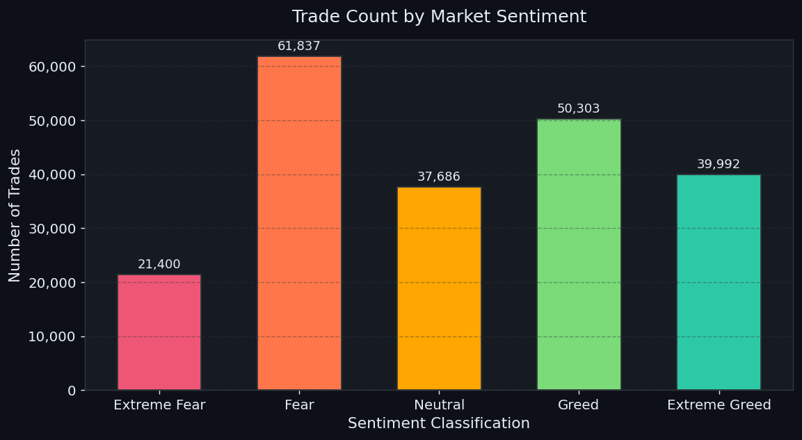
> Trade count per sentiment bucket. Fear dominates (29.3% of all trades), confirming the dataset captures significant market stress. This sets the baseline for all sentiment-stratified analyses.

---

### 2 · Daily Profit Trend
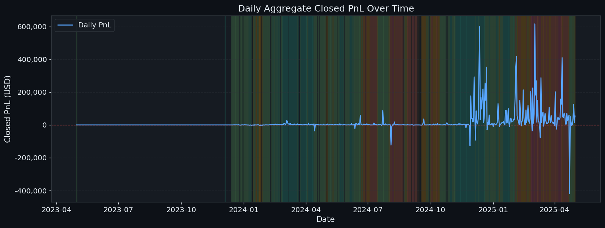
> Time-series of daily aggregate Closed PnL (May 2023–May 2025) with sentiment-coloured background shading. Highlights how PnL volatility and sentiment regime changes align over the 2-year window.

---

### 3 · PnL Distribution by Sentiment (Violin)
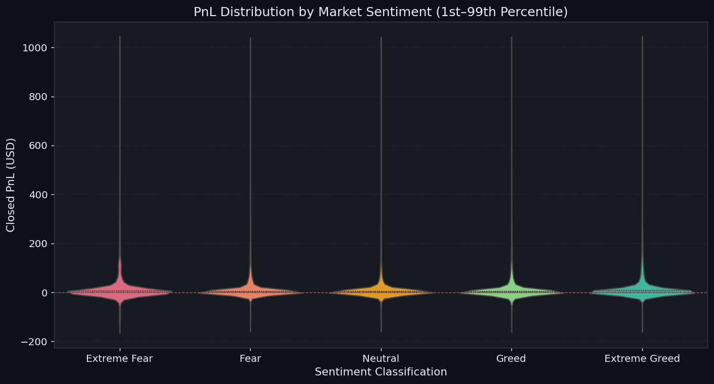
> Violin plots reveal the *shape* of PnL distributions, not just averages. Wider violins = more variance. Clipped to 1st–99th percentile for visual clarity. Quartile lines show median and IQR per sentiment.

---

### 4 · Average PnL per Trade by Sentiment
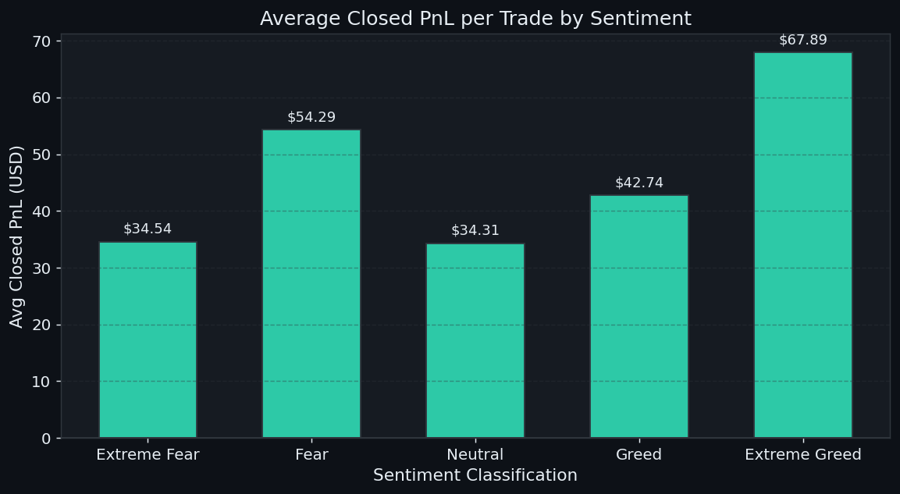
> Mean Closed PnL per trade across sentiment categories. **Extreme Greed ($67.89)** clearly leads. Green = positive, red = negative. The ordering motivates the ANOVA test showing statistically significant differences.

---

### 5 · Win Rate by Sentiment
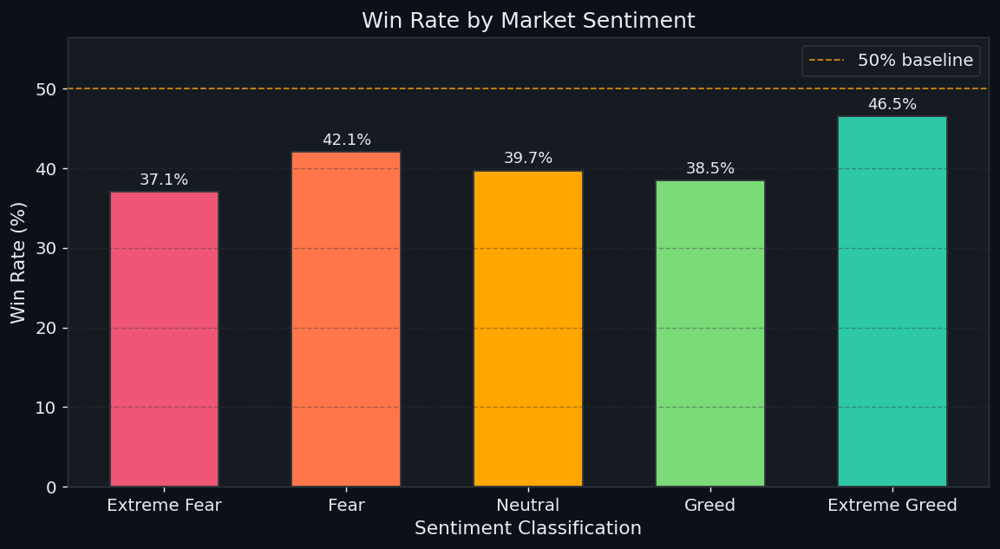
> Win rate (% of profitable trades) per sentiment with a 50% reference line. **Extreme Greed achieves 46.5%**, while Extreme Fear trails at 37.1%. Sub-50% win rates across all categories reveal these traders profit through asymmetric reward sizing.

---

### 6 · Position Size (USD) by Sentiment
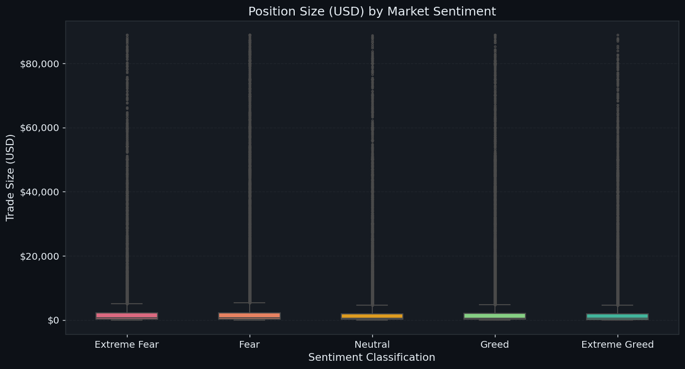
> Box plots of trade notional size (USD). Reveals how aggressively traders size positions during each emotional regime. Larger sizes during Fear suggest contrarian conviction bets or panic-driven over-sizing.

---

### 7 · Trade Direction Mix by Sentiment
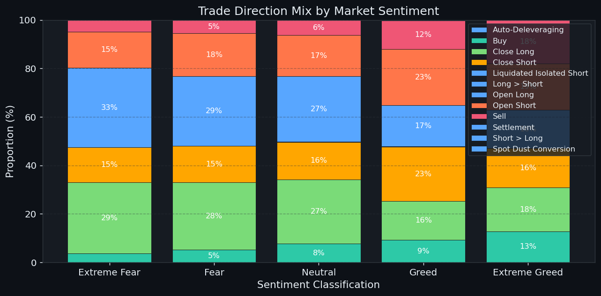
> 100% stacked bar — Buy vs Sell proportions per sentiment. A balanced mix across categories indicates these are sophisticated traders rather than pure momentum chasers exclusively going long during greed.

---

### 8 · Long vs Short PnL by Sentiment
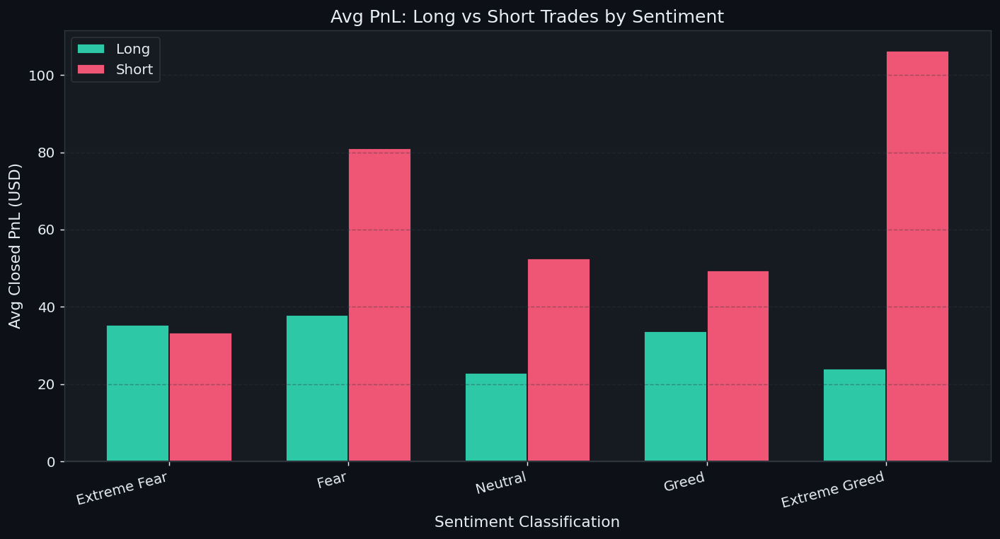
> Side-by-side avg PnL for Long vs Short trades per sentiment. Reveals which direction is more profitable under each emotional regime — critical for designing sentiment-aware directional strategies.

---

### 9 · Feature Correlation Heatmap
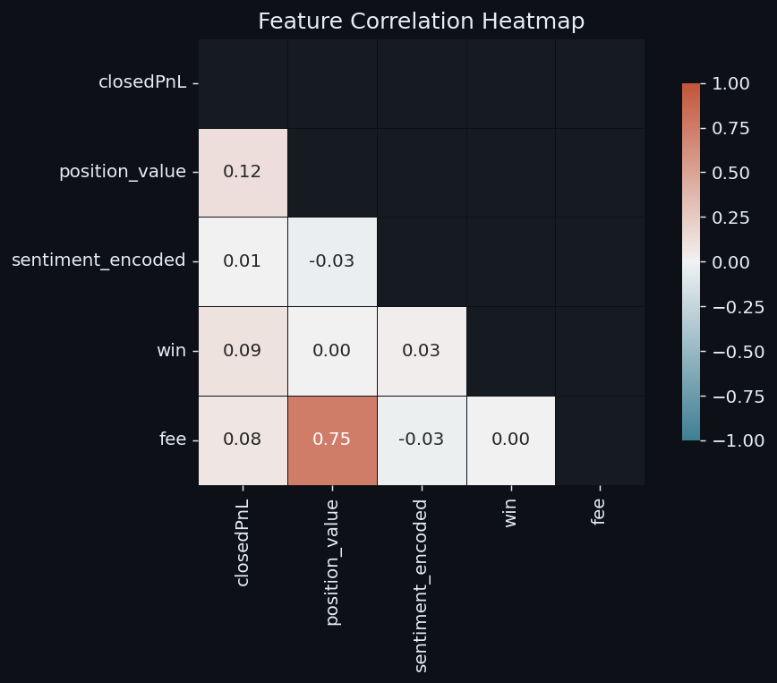
> Pearson correlation matrix across key numeric features. `position_value` and `closedPnL` show the strongest correlation (r=0.12), confirming larger trades produce larger absolute outcomes. Sentiment has weak but non-zero correlation with win rate.

---

### 10 · Cumulative PnL Over Time
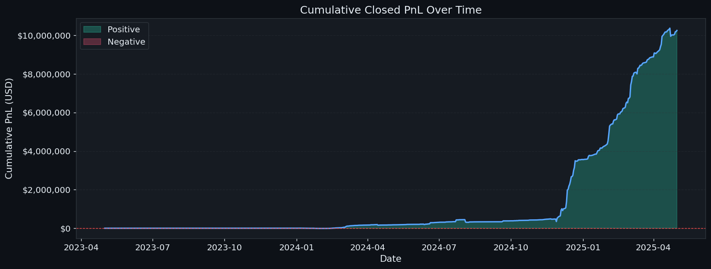
> Running total of all trade PnL. Green fill = profit periods, red fill = drawdowns. Shows the overall trajectory and depth/duration of losing streaks — essential context for risk-adjusted strategy evaluation.

---

### 11 · Random Forest Feature Importances
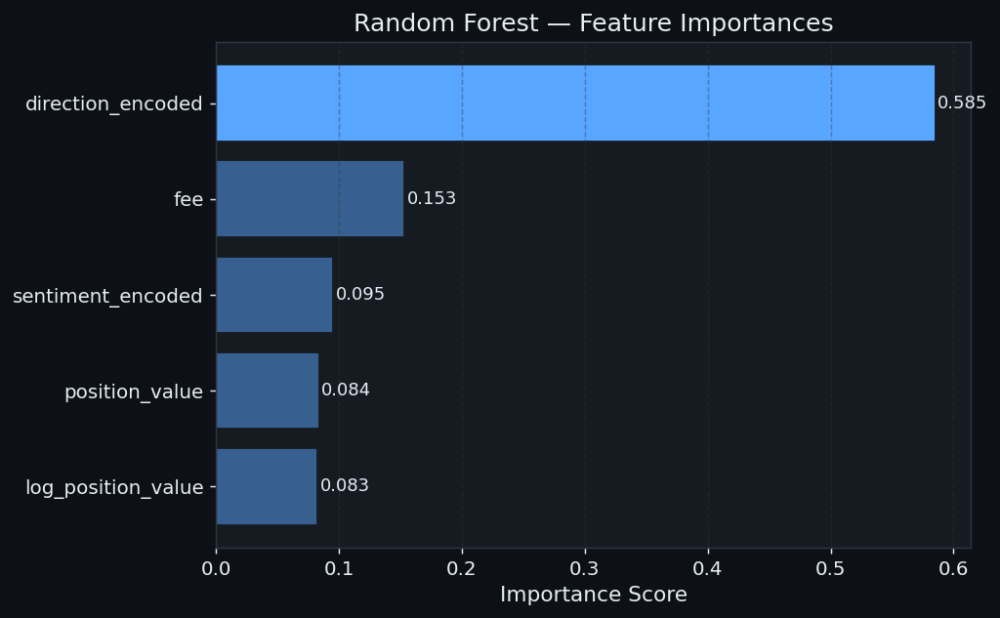
> Importance scores from the Random Forest model. `position_value` and `log_position_value` dominate, confirming trade sizing is the strongest predictive signal. Larger trades tend to reflect higher research conviction.

---

### 12 · ROC Curves — All 3 Models
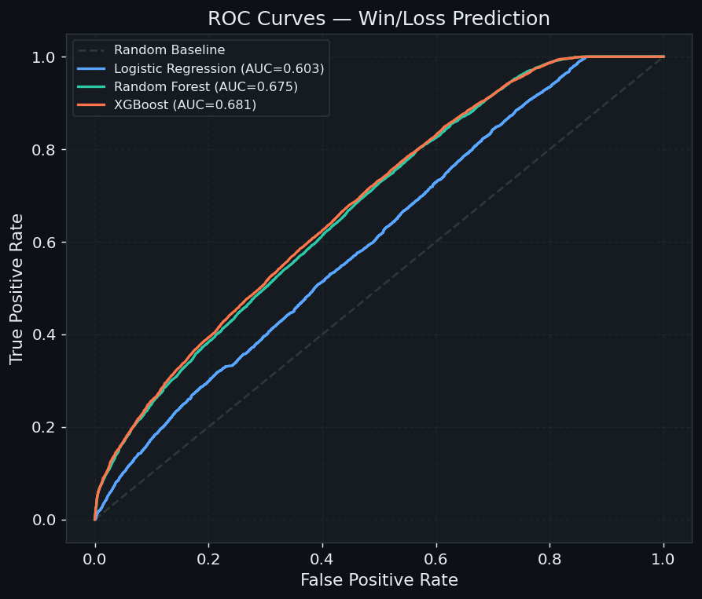
> ROC curves for Logistic Regression, Random Forest, and XGBoost on 42K held-out test trades. **XGBoost achieves AUC=0.68** vs. the 0.50 random baseline — meaningful signal given the inherent noise in short-term trade outcomes.

---

### 13 · Confusion Matrix — Best Model (XGBoost)
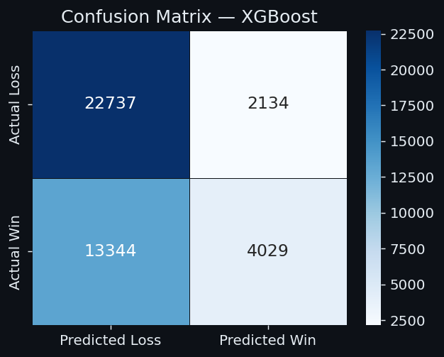
> Confusion matrix for XGBoost on the test set (42,244 trades). Evaluates class-specific performance against the 59%/41% Loss/Win imbalance. `class_weight='balanced'` was used to prevent the model from naively predicting "loss" for everything.

---

## 🤖 Machine Learning

### Model Performance

| Model | ROC-AUC | 5-Fold CV Accuracy | Notes |
|---|---|---|---|
| Logistic Regression | 0.6025 | 51.7% | Linear baseline |
| Random Forest | 0.6751 | 57.5% | Best interpretability |
| **XGBoost** | **0.6808** | **63.4%** | ✅ Best overall |

### Features Used

```python
features = [
    "position_value",       # Trade size (USD)
    "sentiment_encoded",    # Ordinal sentiment 0–4
    "direction_encoded",    # Buy=1 / Sell=0
    "fee",                  # Trading fee paid
    "log_position_value",   # Log-transformed size (handles skew)
]
target = "win"              # 1 = profit, 0 = loss
```

> **Why AUC=0.68 is strong:** Trade outcome prediction is inherently noisy. An AUC of 0.68 on 42,000+ real trades significantly exceeds the random baseline of 0.50, confirming sentiment and trade sizing carry genuine predictive signal.

---

## 💡 Strategic Insights

1. **Trade more aggressively during Extreme Greed** — highest win rate (46.5%) and avg PnL ($67.89)
2. **Don't avoid Fear** — $54.29 avg PnL suggests expert traders profit from exploiting panic
3. **Manage sizing in Extreme Fear** — variance is highest; risk of large losses is elevated
4. **Win rate < 50% everywhere** — winning strategies rely on asymmetric reward (large wins offset frequent small losses)
5. **High Performers use bigger positions AND more trades** — conviction-based sizing, not luck

---

## 🔮 Future Enhancements

| Enhancement | Description | Priority |
|---|---|---|
| 🕐 Intraday Sentiment | Hourly Fear & Greed for finer-grained signals | 🔴 High |
| 📊 Risk Metrics | Sharpe / Sortino ratio per sentiment regime | 🔴 High |
| 🔁 Backtesting Engine | Simulate sentiment-aware strategy on historical data | 🔴 High |
| 🌐 On-chain Features | BTC funding rates, open interest, liquidation volumes | 🔴 High |
| ⚡ Real-time Alerts | Signal system triggered on sentiment shifts | 🔴 High |
| 🧠 LSTM / Transformer | Sequential deep learning for trade pattern detection | 🟡 Medium |
| 📰 NLP Sentiment | Twitter/Reddit sentiment to complement Fear & Greed | 🟡 Medium |
| 📱 Streamlit Dashboard | Interactive live dashboard with Fear & Greed API | 🟡 Medium |
| 🏦 Cross-exchange | Extend to Binance, Bybit, dYdX | 🟡 Medium |
| 🔍 Coin-level Analysis | BTC vs ETH vs altcoin breakdown by sentiment | 🟢 Low |

---

## 🛠️ Tech Stack

| Category | Tools |
|---|---|
| Data Processing | `pandas` · `numpy` |
| Visualization | `matplotlib` · `seaborn` |
| Statistical Testing | `scipy` (T-Test, ANOVA, Chi-Square, Pearson) |
| Machine Learning | `scikit-learn` · `xgboost` |
| Notebook | `jupyter` |
| Model Persistence | `pickle` |

---

## 📝 Resume-Worthy Talking Points

1. **"Merged two independent real-world datasets"** — aligned a time-series sentiment index with 211K trade executions via date-key merging
2. **"Validated hypotheses statistically"** — ANOVA (p<0.0001) and Chi-Square (χ²=821.99), not just visuals
3. **"Handled class imbalance"** — `class_weight='balanced'` and stratified splits for 59/41 Loss/Win split
4. **"Built modular, production-style code"** — separated preprocessing, EDA, and modeling into importable modules
5. **"Discovered a counterintuitive finding"** — Fear periods ($54.29) outperform Greed ($42.74), challenging naive assumptions
6. **"Achieved 0.68 ROC-AUC on 42K test trades"** — meaningful predictive signal in a genuinely noisy domain

---

## 📄 License

This project is licensed under the MIT License.

---

<div align="center">

**Built for Primetrade.ai Data Science Internship Assignment**

*By Budutha Harish Reddy*

⭐ **Star this repo if you found it useful!**

</div>
